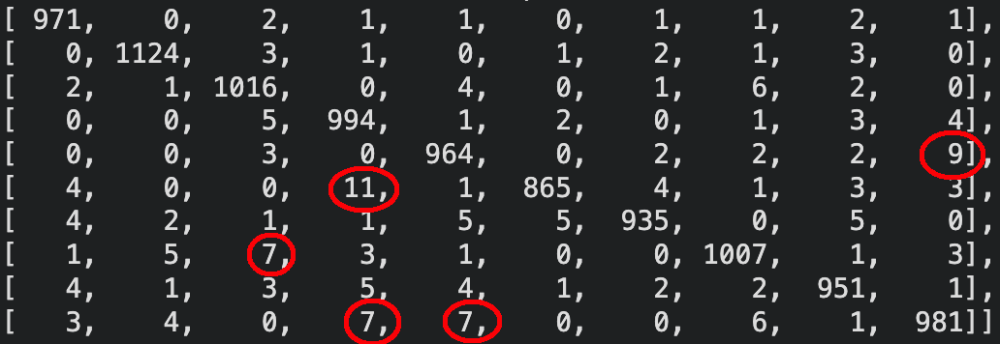
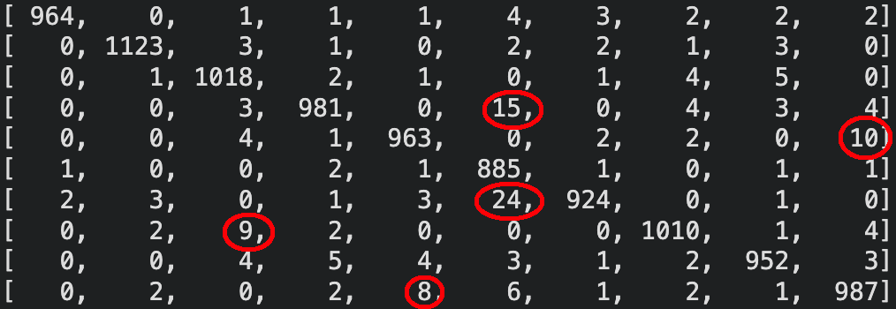
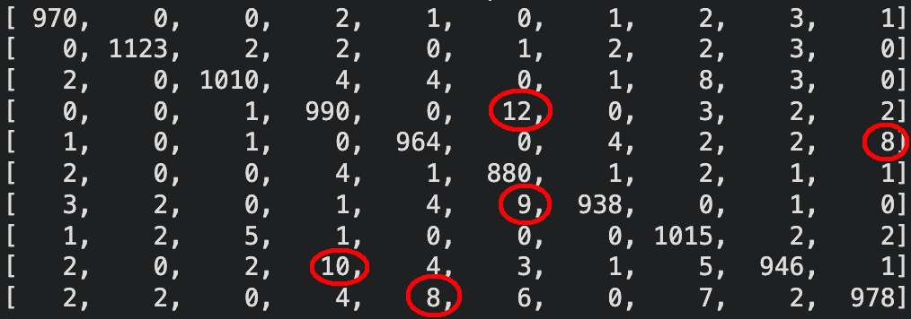

## 2. Digit recognition from raw data

### 2.1 Learning algorithm, params and loss function

The learning algorithm used is `RMSprop`. It adapts the learning rate for each parameter by dividing the gradient with a running average of its recent magnitudes. It prevents gradients from vanishing and ensures a stable convergence. The default parameters are:
- learning_rate = 0.001
- rho = 0.9
- epsilon = 1e-7

The loss function is `categorical_crossentropy`, which is used for multi-class classification.
$$L = -\frac{1}{N} \sum_{i=1}^{N} \sum_{c=1}^{C} y_{i,c} \log(\hat{y}_{i,c})$$
- N is the number of samples
- C = 10 is the number of digit classes
- $y_{i,c} \in \{0,1\}$ is the one-hot encoding of the true class
- $\hat{y}_{i,c}$ is the predicted probability of the class c

### 2.2 Selected topology, inputs and outputs

Each input sample is a 28x28 image, flattened into a vector of 784 input features (one per pixel), normalized in the range [0,1].

The output layer has 10 neurons (one per digit class from 0 to 9), with a softmax activation that converts raw scores into a probability distribution over all classes.

`ReLu` (`max(0, x)`) was preferred over `sigmoid` for the hidden layer because it avoids the vanishing gradient problem and allows for faster convergence. A `Dropout` layer with a rate of 0.2 was added after the hidden layer to prevent overfitting by randomly deactivating 20% of the neurons at each training step.

`EarlyStopping` was usde with a `patience = 5` and `restore_best_weights = True` to monitor `val_loss`. This automatically stops the training when the validation loss stops decreasing for 5 consecutive epochs and restores the weights of the best epoch, thus avoiding overfittinh.

### 2.3 Weight count

The dropout layer has no trainable parameters, it only randomizes zeroes activations during training. The total params count is as follows:
- **Input -> Hidden (512)** : $784 \times 512 = 401 408$ weights + $512$ biases = $401 920$
- **Hidden -> Output (10)** : $512 \times 10 = 5 120$ weights + $10$ biases = $5 130$
- **Total** : $401 920 + 5 130 = 407 050$ parameters

THis matches the output we have in the `.ipynb` given by keras.

### 2.4 Three configurations and their results

#### Configuration 1

**Baseline :**

1 hidden layer, 2 neurons, sigmoid activation, 3 epochs, batch size of 128 and no dropout.
- Test accuracy : ~38%
- The model is severly underfitting. With only 2 hidden neurons, the capacity is far too limited for 10 classes classification problem. The loss curves almost don't decrease and the confusion matrix reveals taht almost all predictions collapse into one or two classes (mostly 1 and 6). This demonstrates that the neural network has almost no discriminative capacity.
- This configuration serves as a lower bound and illustrates how critical the model's capacity is for this problem.

#### Configuration 2

**Improved capacity, no regularisation :**

2 hidden layers, 128 neurons, ReLu activation, 20 epochs, batch size of 128, no dropout.
- Test accuracy : ~97.7%
- Test loss : 0.1049
- Big improvment over the first configuration. Switching from 1 hidden layer to 2, using ReLu instead of sigmoid and increasing the number of neurons from 2 to 128 significantly increases the model's capacity and allows it to capture the non-linearities and complex patterns of the digit dataset. Despite the improvements, the model still overfits after ~12 epochs.

#### Configuration 3

**Final selected model with regularisation and early stopping :**

1 hidden layer, 512 neurons, ReLu activation, dropout with p=0.2, early stopping with patience = 5, batch size = 128, 50 epochs.
- Test accuracy : 98.36%
- Test loss : 0.0576
- Training automatically stopped after 13 epochs, best weights restored from epoch 13 where `val_loss = 0.0587`.
- Adding a dropout and early stopping produces a model with more stable training dynamics. The validation loss curve shows a cleaner descent compared to the second configuration, with slightly less oscillations. Although the final test accuracy is nearly identical to the previous one, the key advantage is that the model generalizes better, the gap between training and validation loss is smaller and the training stops at the optimal point instead of continuing and overfitting.
- This configuration was also tested with Adam optimizer instead of RMSprop. The results were almost identical, with no significant difference in terms of performance. The accuracy was 98.1% with a validation loss of 0.0597 and stopped at epoch 14
- Thid configuration was also tested with 2 hidden layers instead of 1. Accuracy is almost the same, with 98.28% and it goes on for one more epoch, stopping at epoch 14. We still have a better final validation loss with 1 hidden layer.

#### Confusion matrix for the 3rd configuration

The confusion matrix shows a strong dominance in the diagonal accross all 10 classes. The most frequent misclassifications are between :
- 3 interpreted as 5
- 4 interpreted as 9
- 6 interpreted as 5
- 7 interpreted as 2
- 9 interpreted as 4

And sometimes :
- 5 interpreted as 3
- 8 interpreted as 3

## 3. Digit recognition from features of the input data