## 2. Digit recognition from raw data

### 2.1 Learning algorithm, params and loss function

The learning algorithm used is `RMSprop`. It adapts the learning rate for each parameter by dividing the gradient with a running average of its recent magnitudes. It prevents gradients from vanishing and ensures a stable convergence. The default parameters are:
- learning_rate = 0.001
- rho = 0.9
- epsilon = 1e-7

The loss function is `categorical_crossentropy`, which is used for multi-class classification.
$$L = -\frac{1}{N} \sum_{i=1}^{N} \sum_{c=1}^{C} y_{i,c} \log(\hat{y}_{i,c})$$
- N is the number of samples
- C = 10 is the number of digit classes
- $y_{i,c} \in \{0,1\}$ is the one-hot encoding of the true class
- $\hat{y}_{i,c}$ is the predicted probability of the class c

### 2.2 Selected topology, inputs and outputs

Each input sample is a 28x28 image, flattened into a vector of 784 input features (one per pixel), normalized in the range [0,1].

The output layer has 10 neurons (one per digit class from 0 to 9), with a softmax activation that converts raw scores into a probability distribution over all classes.

`ReLu` (`max(0, x)`) was preferred over `sigmoid` for the hidden layer because it avoids the vanishing gradient problem and allows for faster convergence. A `Dropout` layer with a rate of 0.2 was added after the hidden layer to prevent overfitting by randomly deactivating 20% of the neurons at each training step.

`EarlyStopping` was usde with a `patience = 5` and `restore_best_weights = True` to monitor `val_loss`. This automatically stops the training when the validation loss stops decreasing for 5 consecutive epochs and restores the weights of the best epoch, thus avoiding overfittinh.

### 2.3 Weight count

The dropout layer has no trainable parameters, it only randomizes zeroes activations during training. The total params count is as follows:
- **Input -> Hidden (512)** : $784 \times 512 = 401 408$ weights + $512$ biases = $401 920$
- **Hidden -> Output (10)** : $512 \times 10 = 5 120$ weights + $10$ biases = $5 130$
- **Total** : $401 920 + 5 130 = 407 050$ parameters

THis matches the output we have in the `.ipynb` given by keras.

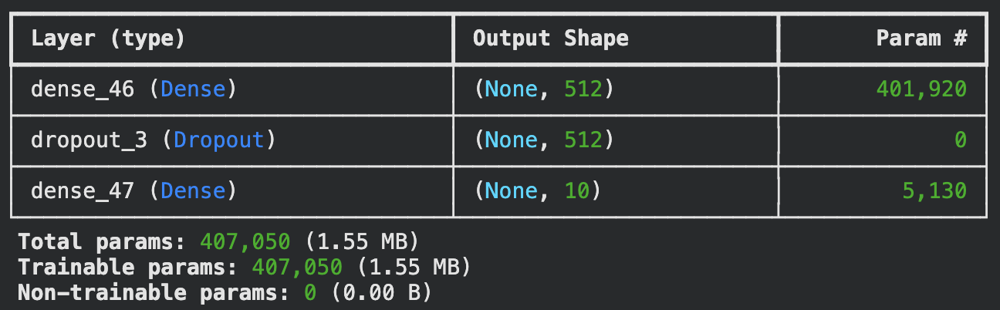

### 2.4 Three configurations and their results

#### Configuration 1

**Baseline :**

1 hidden layer, 2 neurons, sigmoid activation, 3 epochs, batch size of 128 and no dropout.
- Test accuracy : ~38%
- The model is severly underfitting. With only 2 hidden neurons, the capacity is far too limited for 10 classes classification problem. The loss curves almost don't decrease and the confusion matrix reveals taht almost all predictions collapse into one or two classes (mostly 1 and 6). This demonstrates that the neural network has almost no discriminative capacity.
- This configuration serves as a lower bound and illustrates how critical the model's capacity is for this problem.

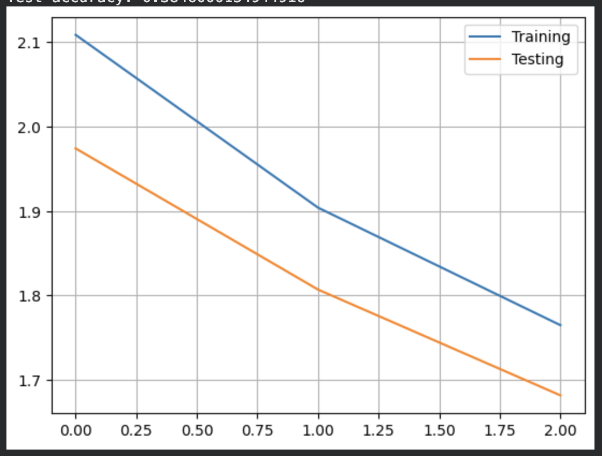

#### Configuration 2

**Improved capacity, no regularisation :**

2 hidden layers, 128 neurons, ReLu activation, 20 epochs, batch size of 128, no dropout.
- Test accuracy : ~97.7%
- Test loss : 0.1049
- Big improvment over the first configuration. Switching from 1 hidden layer to 2, using ReLu instead of sigmoid and increasing the number of neurons from 2 to 128 significantly increases the model's capacity and allows it to capture the non-linearities and complex patterns of the digit dataset. Despite the improvements, the model still overfits after ~12 epochs.

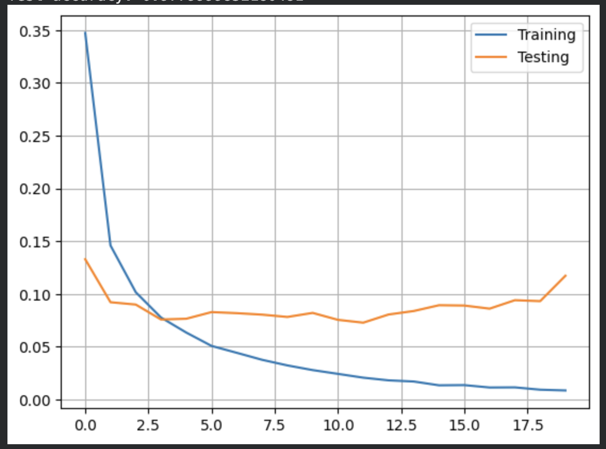

#### Configuration 3

**Final selected model with regularisation and early stopping :**

1 hidden layer, 512 neurons, ReLu activation, dropout with p=0.2, early stopping with patience = 5, batch size = 128, 50 epochs.
- Test accuracy : 98.36%
- Test loss : 0.0576
- Training automatically stopped after 13 epochs, best weights restored from epoch 13 where `val_loss = 0.0587`.
- Adding a dropout and early stopping produces a model with more stable training dynamics. The validation loss curve shows a cleaner descent compared to the second configuration, with slightly less oscillations. Although the final test accuracy is nearly identical to the previous one, the key advantage is that the model generalizes better, the gap between training and validation loss is smaller and the training stops at the optimal point instead of continuing and overfitting.
- This configuration was also tested with Adam optimizer instead of RMSprop. The results were almost identical, with no significant difference in terms of performance. The accuracy was 98.1% with a validation loss of 0.0597 and stopped at epoch 14
- Thid configuration was also tested with 2 hidden layers instead of 1. Accuracy is almost the same, with 98.28% and it goes on for one more epoch, stopping at epoch 14. We still have a better final validation loss with 1 hidden layer.

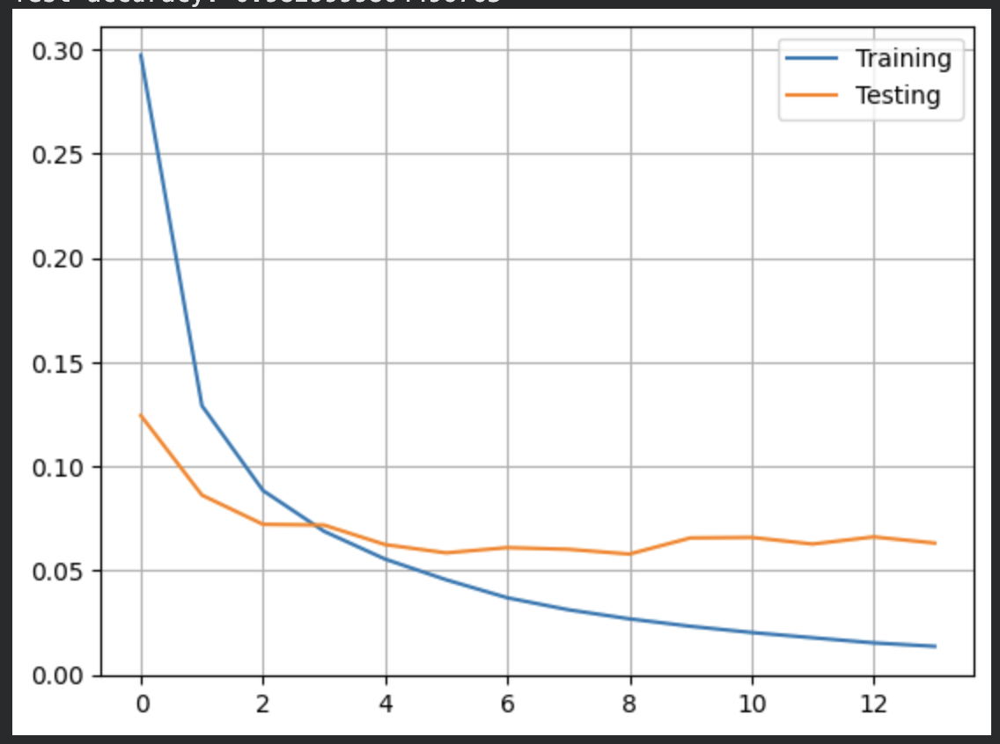

#### Confusion matrix for the 3rd configuration

The confusion matrix shows a strong dominance in the diagonal accross all 10 classes. The most frequent misclassifications are between :
- 3 interpreted as 5
- 4 interpreted as 9
- 6 interpreted as 5
- 7 interpreted as 2
- 9 interpreted as 4

And sometimes :
- 5 interpreted as 3
- 8 interpreted as 3


---

## 3. Digit recognition from features of the input data

### 3.1 Learning algorithm, params and loss function

This is the same as [2.1](#2.1-learning-algorithm-params-and-loss-function), same parameters and loss function.

### 3.2 Neural network topology

Histograms of Oriented Gradients (HOG) is a feature descriptor that captures local shape and appearance information from images by describing the local intensity variations in the image. HOG features are computed by dividing the image into small regions and computing the gradient orientation histogram for each region.

Instead of using raw pixels values like previously, we used HOG for this exercice, with these parameters
- pix_per_cell = 4
- n_orientations = 9
- size formula : $hog\_size = \frac{height \times width \times n\_orientations}{pix\_per\_cell^2} = \frac{28 \times 28 \times 9}{4^2} = 441$

### 3.3 Weight count

- **Input -> Hidden (512)** : $441 \times 512 = 225 792$ weights + $512$ biases = $226 304$
- **Hidden -> Output (10)** : $512 \times 10 = 5 120$ weights + $10$ biases = $5 130$
- **Total** : $226 304 + 5 130 = 231 434$ parameters

Again the keras summary is consistent with our manual calculation.

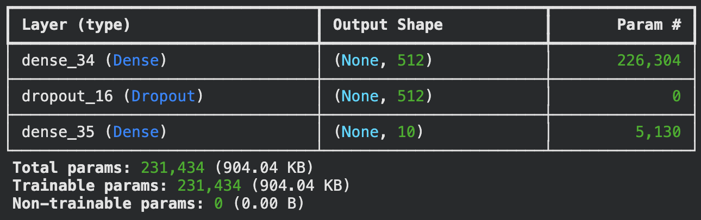

We can notice that the number of parameters is significantly reduced compared to the previous exercise (~231k vs ~407k), but completly normal as we go from 784 pixel to 441 features.

### 3.4 Three configurations and their results

As we got good results in the previous exercise, we decided to keep the same topology for the following configurations. We have 1 hidden layer with 512 neurons, dropout with p=0.2, early stopping with patience = 5 and softmax output. We only changed the pix_per_cell and n_orientations parameters.

#### Configuration 1

**First configuration, is the baseline model as it was given to us.**

pix_per_cell = 4, n_orientations = 9, 2 hidden neurons, epochs = 3, batch_size = 128, no dropout and no early stopping.
- Test accuracy : ~52%
- With only 2 hidden neurons and ReLu activation, the model severly underfits. The confusion matrix reveals that predictions collapse into one or two classes. The class 5 is almost never predicted.
- This mirrors the baseline failure from the previous exercise, the bottleneck of 2 neurons prevents the model from learning a meaningful representation of the HOG features.

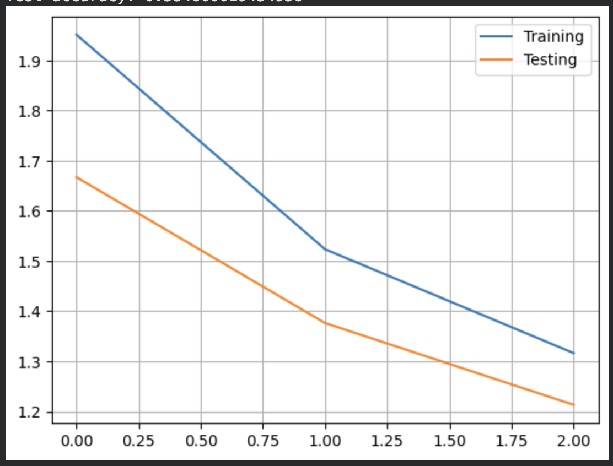

#### Configuration 2

**Large cells, fewer features.**

pix_per_cell = 7, n_orientations = 8, hog_size = 128
- Test accuracy : 97.18%
- Stopped at epoch 25
- With larger cells (7x7 pixels), each cell covers a much larger portion of the 28x28 image. the HOG vector is reduced to only 128 features, capturing more global information about the digit's shape. The training curve shows oscillations in the validation loss, reflecting unstable learning due to the limited feature representation.

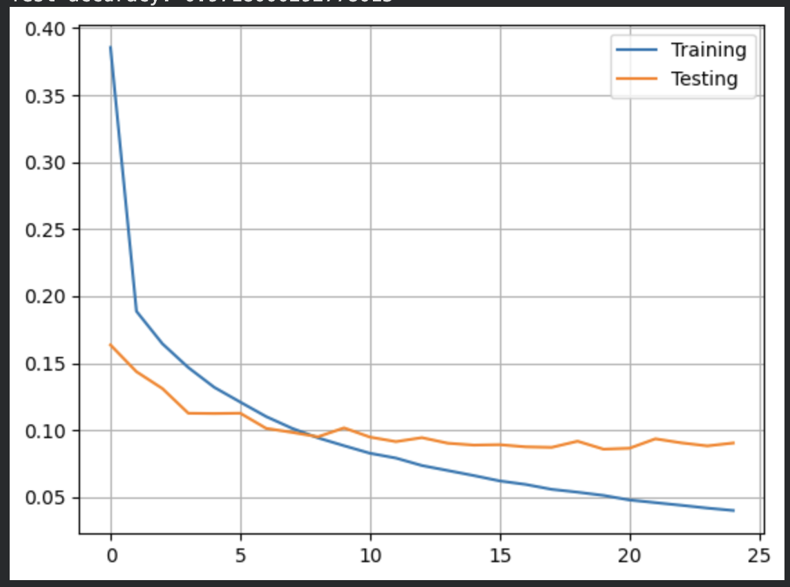

#### Configuration 3

**Final selected model.**

pix_per_cell = 4, n_orientations = 9, hog_size = 441, dropout p = 0.2, early stopping patience = 5
- Test accuracy : 98.41%
- Stopped at epoch 11
- Small 4x4 cells preserve local gradient information across 49 cells per image. Using 9 orientations provides a well-calibrated angular resolution. We tested 10 and 12 orientations, but it didn't improve the accuracy. Both losses converge rapidely at the beginning, with the validation stopping at epoch 11 with a `val_loss = 0.5`.

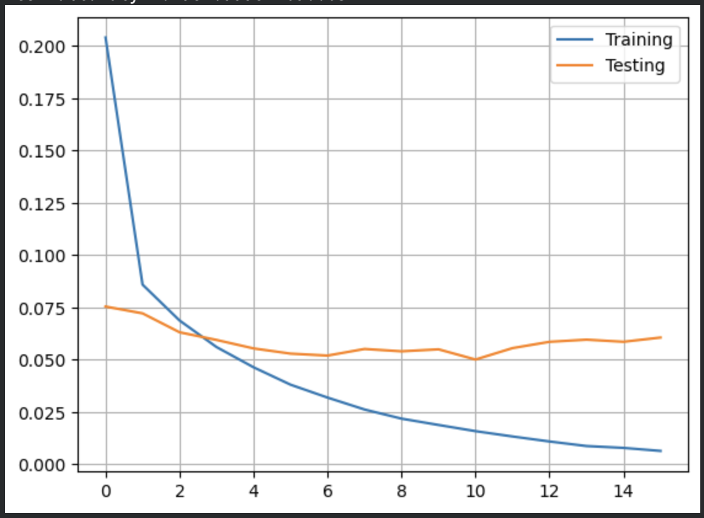


#### Confusion matrix for the 3rd configuration

The following confisions correspond to digits sharing similar stroke orientations in specific image regions. Even a well tuned HOG representation has some trouble to distinguish them. For instance :
- 5 is interpreted as 3
- 4, 7 and 8 are often confused with 9
- 9 is interpreted as 4

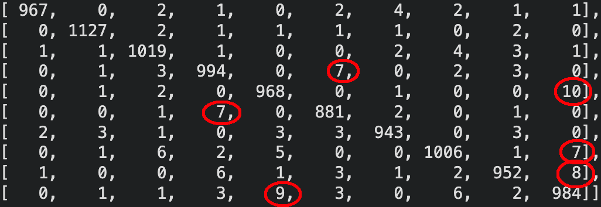

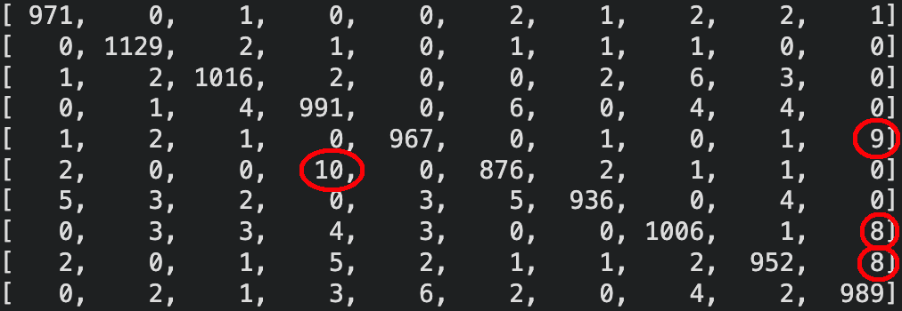

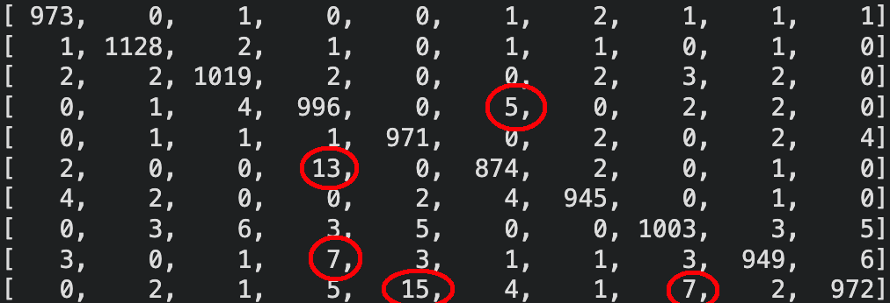

# 4. Convolutional Neural Network : Digit Recognition (MNIST)

The goal of this experiment is to train a convolutional neural network using the MNIST dataset. We are going to try to identify a good neural network configuration that automatically extracts and learns the optimal features necessary for accurate digit recognition. We will modify and evaluate various configurations, comparing their performance to improve the initial model. The best performing model will then be analyzed.

Initial Situation :

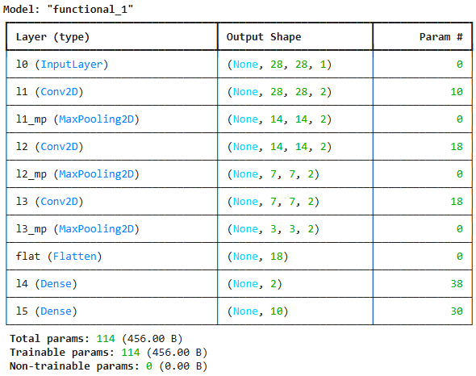
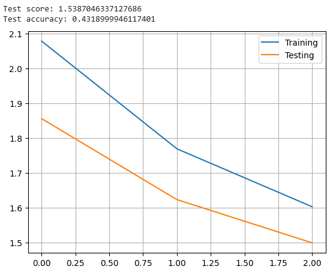

---

## 4.1 Modifying training duration: increasing epochs

One of the first observations from the given training results is the low number of training epochs. Originally set to 3, this low count results in undertraining. To fix this, we increased the number of epochs to 16. This gives the model more iterations over the training data, giving it a chance to learn and refine its weights and biases.

**Impact on Performance:**

| Metric | Initial Model (3 epochs) | Improved Model (16 epochs) |
|--------|--------------------------|---------------------------|
| Test Score | - | 1.0814 |
| Test Accuracy | - | 61.49% |

The graph below shows that both curves are still descending at epoch 16 without stabilizing, which confirms that the base model (only 2 filters and 2 Dense neurons) is too limited to converge properly, even with more epochs.

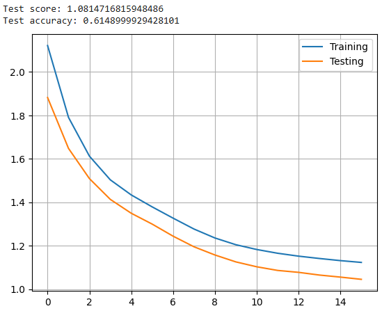

---

## 4.2 Increasing the number of neurons in the fully connected (Dense) layer

A good way to increase the model's capacity to learn complex patterns is to increase the number of neurons in the fully connected layer. Initially, our model used only 2 neurons in this layer, which was a limiting factor for classification. We increased this to 128 neurons, a classic power-of-two value.

**Changes made:**

```python
l4 = Dense(128, activation='relu', name='l4')(flat)
```

**Model summary:**

| Layer | Output Shape | Param # |
|-------|-------------|---------|
| l0 (InputLayer) | (None, 28, 28, 1) | 0 |
| l1 (Conv2D) | (None, 28, 28, 2) | 10 |
| l1_mp (MaxPooling2D) | (None, 14, 14, 2) | 0 |
| l2 (Conv2D) | (None, 14, 14, 2) | 18 |
| l2_mp (MaxPooling2D) | (None, 7, 7, 2) | 0 |
| l3 (Conv2D) | (None, 7, 7, 2) | 18 |
| l3_mp (MaxPooling2D) | (None, 3, 3, 2) | 0 |
| flat (Flatten) | (None, 18) | 0 |
| l4 (Dense) | (None, 128) | 2432 |
| l5 (Dense) | (None, 10) | 1290 |

**Results:**

| Metric | Value |
|--------|-------|
| Test score | 0.3176 |
| Test accuracy | 89.61% |

The graph shows a stable convergence with no overfitting, both curves decrease together smoothly. However the accuracy is still limited by the small number of convolutional filters (only 2 per layer).

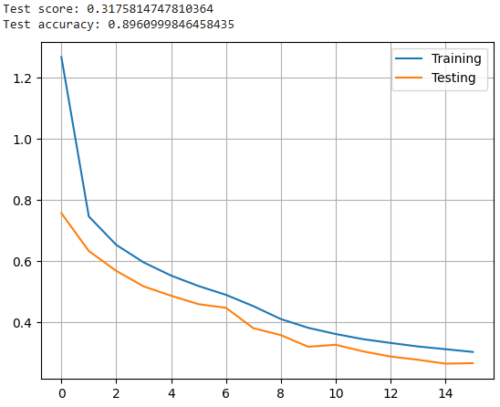

---

## 4.3 Increasing convolutional filters: 4, 8, 16

Instead of removing the third convolutional layer, we kept all three layers but significantly increased the number of filters: 4 for l1, 8 for l2, and 16 for l3. This allows the network to extract a richer and more diverse set of features at each level of the hierarchy while still preserving the 3-level depth.

**Changes made:**

```python
l0 = Input(shape=(height, width, 1), name='l0')

l1 = Conv2D(4, (2, 2), padding='same', activation='relu', name='l1')(l0)
l1_mp = MaxPooling2D(pool_size=(2, 2), name='l1_mp')(l1)

l2 = Conv2D(8, (2, 2), padding='same', activation='relu', name='l2')(l1_mp)
l2_mp = MaxPooling2D(pool_size=(2, 2), name='l2_mp')(l2)

l3 = Conv2D(16, (2, 2), padding='same', activation='relu', name='l3')(l2_mp)
l3_mp = MaxPooling2D(pool_size=(2, 2), name='l3_mp')(l3)

flat = Flatten(name='flat')(l3_mp)

l4 = Dense(128, activation='relu', name='l4')(flat)
l5 = Dense(n_classes, activation='softmax', name='l5')(l4)
```

**Model summary:**

| Layer | Output Shape | Param # |
|-------|-------------|---------|
| l0 (InputLayer) | (None, 28, 28, 1) | 0 |
| l1 (Conv2D) | (None, 28, 28, 4) | 20 |
| l1_mp (MaxPooling2D) | (None, 14, 14, 4) | 0 |
| l2 (Conv2D) | (None, 14, 14, 8) | 136 |
| l2_mp (MaxPooling2D) | (None, 7, 7, 8) | 0 |
| l3 (Conv2D) | (None, 7, 7, 16) | 528 |
| l3_mp (MaxPooling2D) | (None, 3, 3, 16) | 0 |
| flat (Flatten) | (None, 144) | 0 |
| l4 (Dense) | (None, 128) | 18560 |
| l5 (Dense) | (None, 10) | 1290 |
| **Total** | | **20,534** |

**Results:**

| Metric | Value |
|--------|-------|
| Test score | 0.0453 |
| Test accuracy | 98.66% |

**Impact on Performance:** This configuration produced a dramatic improvement, jumping from 89.61% to 98.66% accuracy. The loss curve shows both curves converging closely together with no sign of overfitting, achieving this with only 20,534 total parameters.

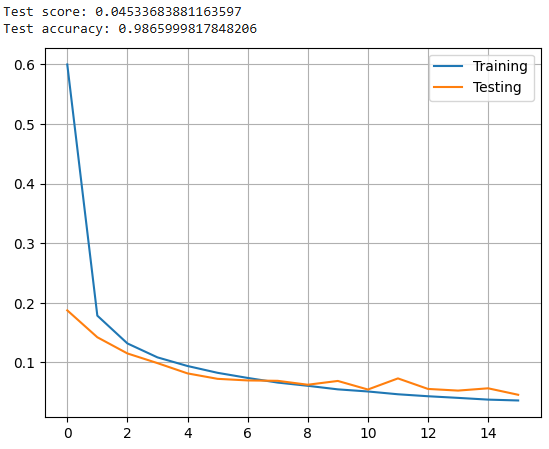

---

## 4.4 Larger kernel size: 5X5 filters

To explore the effect of kernel size, we replaced the 2X2 kernels with 5X5 kernels and reduced to two convolutional layers (8 and 16 filters). A larger kernel captures broader spatial features at each layer, which can help recognize the global shape of digits more effectively.

**Changes made:**

```python
l0 = Input(shape=(height, width, 1), name='l0')

l1 = Conv2D(8, (5, 5), padding='same', activation='relu', name='l1')(l0)
l1_mp = MaxPooling2D(pool_size=(2, 2), name='l1_mp')(l1)

l2 = Conv2D(16, (5, 5), padding='same', activation='relu', name='l2')(l1_mp)
l2_mp = MaxPooling2D(pool_size=(2, 2), name='l2_mp')(l2)

flat = Flatten(name='flat')(l2_mp)

l4 = Dense(128, activation='relu', name='l4')(flat)
l5 = Dense(n_classes, activation='softmax', name='l5')(l4)
```

**Model summary:**

| Layer | Output Shape | Param # |
|-------|-------------|---------|
| l0 (InputLayer) | (None, 28, 28, 1) | 0 |
| l1 (Conv2D) | (None, 28, 28, 8) | 208 |
| l1_mp (MaxPooling2D) | (None, 14, 14, 8) | 0 |
| l2 (Conv2D) | (None, 14, 14, 16) | 3216 |
| l2_mp (MaxPooling2D) | (None, 7, 7, 16) | 0 |
| flat (Flatten) | (None, 784) | 0 |
| l4 (Dense) | (None, 128) | 100480 |
| l5 (Dense) | (None, 10) | 1290 |
| **Total** | | **105,194** |

**Results:**

| Metric | Value |
|--------|-------|
| Test score | 0.0399 |
| Test accuracy | 99.04% |

**Impact on Performance:** The 5×5 kernel further improved accuracy to 99.04%. However, the total parameter count jumped to 105,194, mostly due to the larger flattened output feeding into the Dense layer (100,480 parameters in l4 alone). The loss curve shows slight overfitting: the training loss continues decreasing toward 0 while the testing loss stabilizes with small oscillations around 0.04.

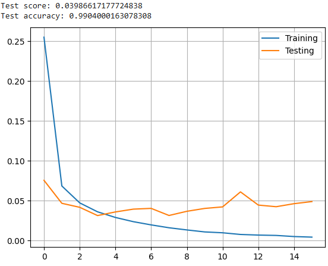

---

## 4.5 Reducing overfitting with dropout regularization (final model)

To mitigate the overfitting observed in the previous configuration, we introduced dropout regularization. This technique prevents overfitting by randomly disabling a subset of neurons during training, forcing the network to learn more robust features. We used a more aggressive dropout rate of 0.3 after each pooling layer and 0.5 before the final output layer.

**Full architecture:**

```python
l0 = Input(shape=(height, width, 1), name='l0')

l1 = Conv2D(8, (5, 5), padding='same', activation='relu', name='l1')(l0)
l1_mp = MaxPooling2D(pool_size=(2, 2), name='l1_mp')(l1)
l1_drop = Dropout(0.3, name='l1_drop')(l1_mp)

l2 = Conv2D(16, (5, 5), padding='same', activation='relu', name='l2')(l1_drop)
l2_mp = MaxPooling2D(pool_size=(2, 2), name='l2_mp')(l2)
l2_drop = Dropout(0.3, name='l2_drop')(l2_mp)

flat = Flatten(name='flat')(l2_drop)

l4 = Dense(128, activation='relu', name='l4')(flat)
l4_drop = Dropout(0.5, name='l4_drop')(l4)
l5 = Dense(n_classes, activation='softmax', name='l5')(l4_drop)
```

**Model summary:**

| Layer | Output Shape | Param # |
|-------|-------------|---------|
| l0 (InputLayer) | (None, 28, 28, 1) | 0 |
| l1 (Conv2D) | (None, 28, 28, 8) | 208 |
| l1_mp (MaxPooling2D) | (None, 14, 14, 8) | 0 |
| l1_drop (Dropout) | (None, 14, 14, 8) | 0 |
| l2 (Conv2D) | (None, 14, 14, 16) | 3216 |
| l2_mp (MaxPooling2D) | (None, 7, 7, 16) | 0 |
| l2_drop (Dropout) | (None, 7, 7, 16) | 0 |
| flat (Flatten) | (None, 784) | 0 |
| l4 (Dense) | (None, 128) | 100480 |
| l4_drop (Dropout) | (None, 128) | 0 |
| l5 (Dense) | (None, 10) | 1290 |
| **Total** | | **105,194** |

**Results:**

| Metric | Value |
|--------|-------|
| Test score | 0.0283 |
| Test accuracy | 99.12% |

**Impact on Performance:** The dropout layers successfully reduced overfitting. The loss curve is much cleaner compared to config 4: the testing loss decreases steadily and stabilizes well below the training loss, without the oscillations seen before. The accuracy also slightly improved from 99.04% to 99.12%.

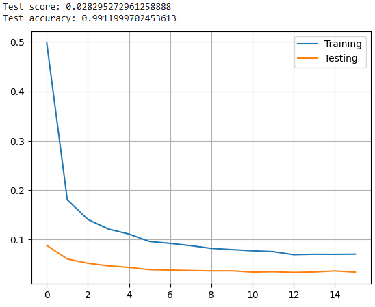

---

## 4.6 Architecture and weight calculation of the final model

### Layer description

**Input Layer (l0):** Receives images of size 28X28 with 1 channel (grayscale). Entry point for data, performs no computation.

**Convolutional Layers:**
- l1: 8 filters of size 5X5 with ReLU activation. Output: 28X28X8 (same padding preserves spatial dimensions).
- l2: 16 filters of size 5X5 with ReLU activation. Output: 14X14X16.

**Pooling Layers:** l1_mp and l2_mp perform max pooling with a 2X2 window, halving the dimensions: l1_mp -> 14X14X8, l2_mp -> 7X7X16.

**Dropout Layers:** l1_drop, l2_drop (rate 0.3) and l4_drop (rate 0.5) prevent overfitting. These layers add no weights.

**Dense Layers:**
- l4: 128 neurons with ReLU activation.
- l5: 10 neurons with Softmax activation (one output per digit class).

### Weight calculation

**Convolutional layers:**

$$l1 : (5 \times 5 \times 1) \times 8 + 8 = 208 \text{ parameters}$$

$$l2 : (5 \times 5 \times 8) \times 16 + 16 = 3216 \text{ parameters}$$

**Dense layers:**

$$l4 : 784 \times 128 + 128 = 100480 \text{ parameters}$$

$$l5 : 128 \times 10 + 10 = 1290 \text{ parameters}$$

**Total: 208 + 3216 + 100480 + 1290 = 105,194 parameters**

---

## 4.7 Performance discussion

The tuning process showed a clear and progressive improvement in accuracy and a decrease in loss at each step.

### Confusion matrix

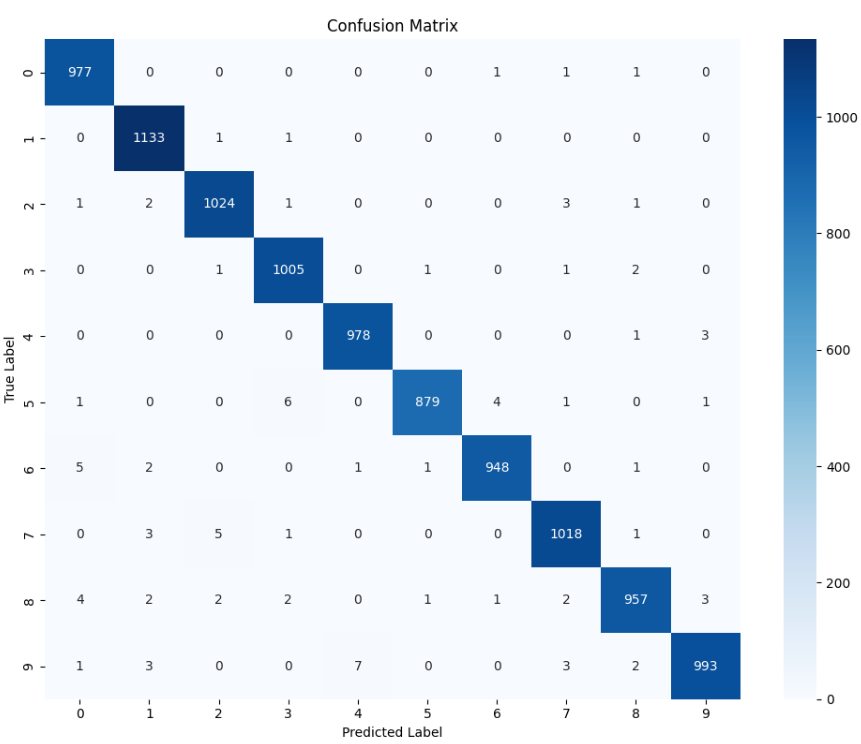

The confusion matrix confirms the strong performance of the final model. The diagonal is highly dominant, meaning most digits are correctly classified. The most frequently confused digits are **5** (6 samples predicted as 3) and **8** (4 samples predicted as 0), which is expected given their visual similarity.

### Accuracy per digit

From the confusion matrix, we can extract the per-digit accuracy:

| Digit | Correct | Total | Accuracy |
|-------|---------|-------|----------|
| 0 | 977 | 980 | 99.69% |
| 1 | 1133 | 1135 | 99.82% |
| 2 | 1024 | 1032 | 99.22% |
| 3 | 1005 | 1010 | 99.50% |
| 4 | 978 | 982 | 99.59% |
| 5 | 879 | 892 | 98.54% |
| 6 | 948 | 958 | 98.96% |
| 7 | 1018 | 1028 | 99.03% |
| 8 | 957 | 974 | 98.25% |
| 9 | 993 | 1009 | 98.41% |

Digit **1** achieves the highest accuracy (99.82%), likely due to its simple and distinctive vertical stroke. Digits **8** and **5** are the most challenging, as they share visual features with several other digits.

---

## 4.8 Comparison of all configurations

| Config | Description | Test Score | Test Accuracy |
|--------|-------------|------------|---------------|
| 1 | Base model + 16 epochs | 1.0814 | 61.49% |
| 2 | Dense 128 neurons | 0.3176 | 89.61% |
| 3 | Conv filters 4/8/16 | 0.0453 | 98.66% |
| 4 | Kernel 5×5, filters 8/16 | 0.0399 | 99.04% |
| **5** | **+ Dropout 0.3/0.5** | **0.0283** | **99.12%** |

The results clearly show that increasing the number of convolutional filters (config 3) was the most impactful single change, producing a jump from 89.61% to 98.66%. Moving to larger 5X5 kernels (config 4) further improved accuracy at the cost of a significantly higher parameter count. Finally, adding dropout (config 5) both improved accuracy slightly and produced a cleaner, more stable training curve by reducing overfitting.

### Comparison with previous sections

| Model | Best Accuracy | Parameters |
|-------|--------------|------------|
| MLP from raw data (Section 2) | 98.36% | 407,050 |
| MLP from HOG features (Section 3) | 98.41% | 231,434 |
| **CNN (Section 4)** | **99.12%** | **105,194** |

The CNN outperforms both shallow approaches while using significantly fewer parameters. The MLP from raw data required 407,050 parameters to reach 98.36%, whereas our CNN achieves 99.12% with only 105,194 parameters; nearly 4X fewer. This highlights the key advantage of convolutional layers: by sharing weights across the image through local filters, they extract spatial features far more efficiently than fully connected layers.

The HOG-based MLP (98.41%) was already more parameter-efficient than the raw MLP (231,434 vs 407,050) thanks to the feature reduction from 784 to 441 inputs, and it performed slightly better. However the CNN still surpasses it both in accuracy and efficiency, because it learns its own optimal features directly from the raw pixel data through training, rather than relying on a hand-crafted feature extractor like HOG.

---

## 4.9 Do CNNs have more weights than shallow networks?

The relationship between the depth of a CNN and the number of weights it contains is not strictly linear. Deeper networks have more layers, but the size of those layers and the kernel size also affect the total parameter count. Furthermore, CNNs include layers that do not increase the parameter count at all, such as pooling and dropout layers.

**Comparative example:**

**Shallow Neural Network (MLP):**
- Input: 784 (flattened 28X28)
- Dense layer 1: 128 neurons -> 784 * 128 + 128 = 100,480 parameters
- Output layer: 10 neurons -> 128 * 10 + 10 = 1,290 parameters
- **Total: 101,770 parameters**

**Deeper CNN (our config 3):**
- Conv layer 1: 4 filters 2X2 -> (2 * 2 * 1 * 4) + 4 = 20 parameters
- Conv layer 2: 8 filters 2X2 -> (2 * 2 * 4 * 8) + 8 = 136 parameters
- Conv layer 3: 16 filters 2X2 -> (2 * 2 * 8 * 16) + 16 = 528 parameters
- Dense layer: 144 * 128 + 128 = 18,560 parameters
- Output layer: 128 * 10 + 10 = 1,290 parameters
- **Total: 20,534 parameters**

Despite having more layers, config 3 (CNN) has **5X fewer weights** than the shallow MLP, while achieving 98.66% accuracy vs what a comparable MLP would achieve. This is because dense layers connect every input to every neuron, generating a very large number of parameters, whereas convolutional layers only connect each filter to a local region of the input image, drastically reducing the parameter count despite the added depth.

# 5. Chest X-ray Pneumonia Detection

The goal of this experiment is to train a convolutional neural network to classify chest X-ray images into two categories: normal and pneumonia. The dataset contains 5216 images for training, 16 images for validation and 624 images for testing.

---

## 5.1 Dataset

The dataset consists of grayscale chest X-ray images resized to 128X128 pixels, split into three sets:

| Set | Images |
|-----|--------|
| Training | 5216 |
| Validation | 16 |
| Test | 624 |


The dataset is significantly imbalanced, with more pneumonia cases than normal cases in the training set. To address this, class weights were computed and applied during training:

| Class | Weight |
|-------|--------|
| Normal (0) | 1.9448 |
| Pneumonia (1) | 0.6730 |

The higher weight for the Normal class forces the model to pay more attention to the minority class during training, preventing it from simply predicting pneumonia for every sample.

---

## 5.2 Model Architecture

The CNN model consists of 5 convolutional layers each followed by a max pooling layer, and 2 fully connected dense layers before the final output. The convolutional layers progressively extract spatial hierarchies of features from the images, while the dense layers classify these features into the two categories.

```python
input = layers.Input((IMG_HEIGHT, IMG_WIDTH, 1))

l1 = layers.Conv2D(8, (3, 3), padding='same', activation='relu', name='l1')(input)
l1_mp = layers.MaxPooling2D((2, 2), name='l1_mp')(l1)

l2 = layers.Conv2D(16, (3, 3), padding='same', activation='relu', name='l2')(l1_mp)
l2_mp = layers.MaxPooling2D((2, 2), name='l2_mp')(l2)

l3 = layers.Conv2D(32, (3, 3), padding='same', activation='relu', name='l3')(l2_mp)
l3_mp = layers.MaxPooling2D((2, 2), name='l3_mp')(l3)

l4 = layers.Conv2D(64, (3, 3), padding='same', activation='relu', name='l4')(l3_mp)
l4_mp = layers.MaxPooling2D((2, 2), name='l4_mp')(l4)

l5 = layers.Conv2D(128, (3, 3), padding='same', activation='relu', name='l5')(l4_mp)
l5_mp = layers.MaxPooling2D((2, 2), name='l5_mp')(l5)

flat = layers.Flatten(name='flat')(l5_mp)

l6 = layers.Dense(32, activation='relu', name='l6')(flat)
l7 = layers.Dense(16, activation='relu', name='l7')(l6)

cnn_output = layers.Dense(1, activation='sigmoid')(l7)
```

**Layer-by-layer summary:**

| Layer | Output Shape | Param # |
|-------|-------------|---------|
| input (InputLayer) | (None, 128, 128, 1) | 0 |
| l1 (Conv2D) | (None, 128, 128, 8) | 80 |
| l1_mp (MaxPooling2D) | (None, 64, 64, 8) | 0 |
| l2 (Conv2D) | (None, 64, 64, 16) | 1168 |
| l2_mp (MaxPooling2D) | (None, 32, 32, 16) | 0 |
| l3 (Conv2D) | (None, 32, 32, 32) | 4640 |
| l3_mp (MaxPooling2D) | (None, 16, 16, 32) | 0 |
| l4 (Conv2D) | (None, 16, 16, 64) | 18496 |
| l4_mp (MaxPooling2D) | (None, 8, 8, 64) | 0 |
| l5 (Conv2D) | (None, 8, 8, 128) | 73856 |
| l5_mp (MaxPooling2D) | (None, 4, 4, 128) | 0 |
| flat (Flatten) | (None, 2048) | 0 |
| l6 (Dense) | (None, 32) | 65568 |
| l7 (Dense) | (None, 16) | 528 |
| dense (Dense) | (None, 1) | 17 |

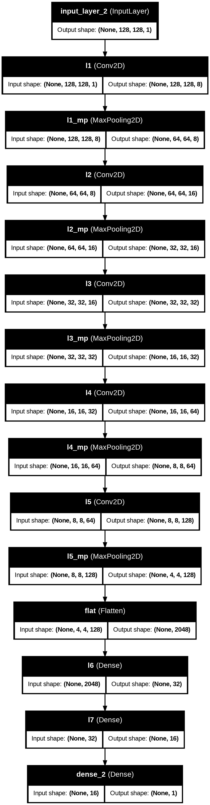

The architecture follows a progressive reduction of spatial dimensions (128->64->32->16->8->4) while increasing the number of filters (8->16->32->64->128), allowing the network to learn increasingly abstract features. The Flatten layer converts the final 4X4X128 volume into a 2048-element vector, which is then compressed through the Dense layers (32->16->1) down to a single binary output.

---

## 5.3 Training Process

The model was trained using the following configuration:

| Parameter | Value |
|-----------|-------|
| Optimizer | Adam |
| Learning rate | 0.001 |
| Loss function | Binary Crossentropy |
| Epochs | 5 |
| Batch size | 64 |
| Class weights | Yes (1.9448 / 0.6730) |

**Binary Crossentropy loss function:**

$$L = -\frac{1}{N} \sum_{i=1}^{N} \left[ y_i \log(\hat{y}_i) + (1 - y_i) \log(1 - \hat{y}_i) \right]$$

Where $y_i$ is the true label (0 or 1) and $\hat{y}_i$ is the predicted probability.

### Loss curve

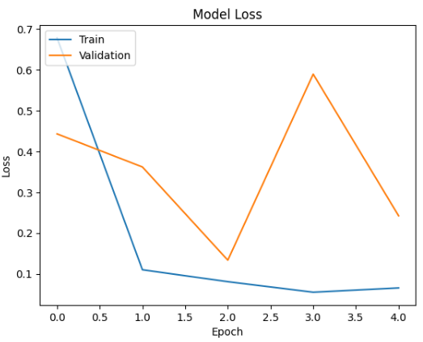

The training loss decreases steadily and converges near 0.05 by epoch 4. The validation loss however shows high variability, it decreases at epoch 2 but spikes back up at epoch 3 before dropping again at epoch 4. This instability is directly caused by the very small validation set (only 16 images), where a single misclassified image has a large impact on the computed loss.

### Accuracy curve

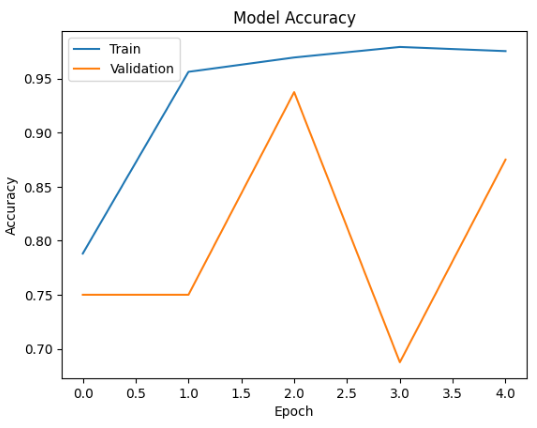

The training accuracy improves consistently, reaching ~97% by epoch 4. The validation accuracy also shows high variability for the same reason (only 16 validation samples), oscillating between 69% and 94% across epochs. This makes it difficult to use the validation set as a reliable indicator of generalization.

---

## 5.4 Validation Results

### Confusion Matrix

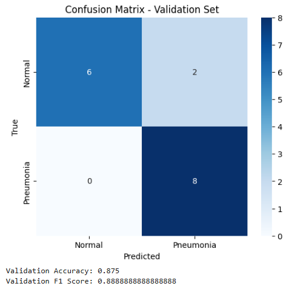

| Metric | Value |
|--------|-------|
| Accuracy | 87.5% |
| F1-score | 88.89% |

Out of 16 validation images, the model correctly classified 6 Normal and 8 Pneumonia cases. It misclassified 2 Normal cases as Pneumonia (false positives) and 0 Pneumonia cases as Normal (false negatives).

The absence of false negatives is encouraging from a medical perspective, missing a pneumonia case (false negative) is more dangerous than a false positive, as it could result in an untreated patient.

---

## 5.5 Test Results

### Confusion Matrix

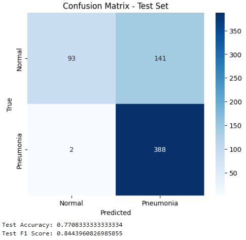

| Metric | Value |
|--------|-------|
| Accuracy | 77.08% |
| F1-score | 84.44% |

On the test set of 624 images, the model correctly classified 93 Normal and 388 Pneumonia cases. However it misclassified 141 Normal cases as Pneumonia (false positives) and only 2 Pneumonia cases as Normal (false negatives).

---

## 5.6 Discussion

The model shows a clear bias toward predicting Pneumonia, which is expected given the class imbalance in the training set (more pneumonia samples than normal). Despite the class weights applied during training, the model still struggles to correctly identify Normal cases, as shown by the 141 false positives on the test set.

The gap between validation accuracy (87.5%) and test accuracy (77.08%) suggests that the model does not generalize perfectly to unseen data. This could be improved by increasing the number of epochs, adding dropout layers to reduce overfitting, or using data augmentation to artificially balance the dataset.

The F1-score (84.44% on test) is higher than the accuracy (77.08%), which confirms that the model handles the class imbalance reasonably well in terms of precision/recall balance. In a medical context, the very low false negative rate (only 2 missed pneumonia cases out of 390) is the most important result, as failing to detect pneumonia is far more critical than a false alarm.

